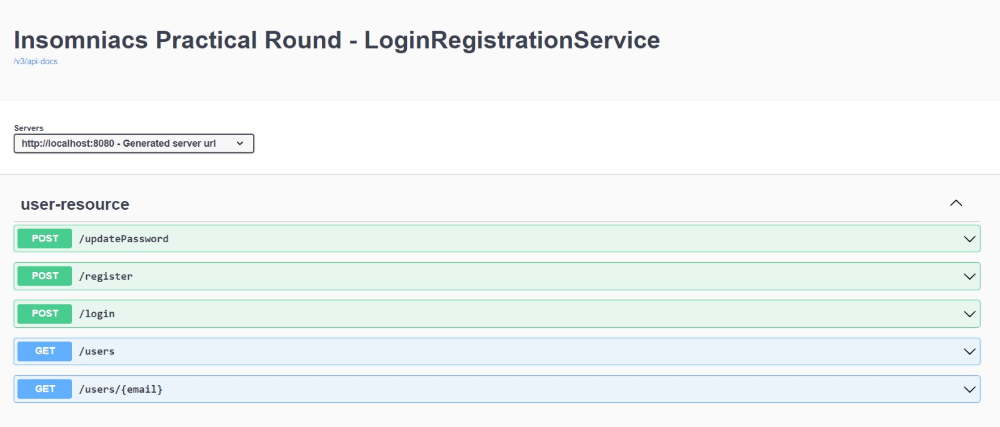

# Login and Registration REST API
## Login and Registration service with following APIs
* Registration API
* Login API
* Update password API
* Search user API
* List users API

## Requirements to run this Project:
* Java 8 or higher run time setup in host OS env
* Maven 3 configured in the env

## How to Run this service ?
* Clone this repo into your local
* Open an IDE (Eclipse, IntelliJ, NetBeans)
* Select Import -> Existing Maven project and browse through the cloned project as root directory
* Right click on the added project and select Run As -> Java Application
* Open "http://localhost:8080/swagger-ui/index.html" to hit the apis

## More Info
* Server will be listening on port 8080
* Endpoints
	1. POST /register
		- To register a new user 
		- RequestBody should be in format 
		```json
		{
			"user_name": "string",
  			"mobile_no": "string",
  			"email": "string",
  			"password": "string"
		}
		```
		- There are validations for user_name to be of atleast length 2, mobile_no to be of 10 digits, valid and unique email and password of minimum length 5.
		- Error with appropriate message will be shown if the request body is not valid.


	2. POST /login
		- To login a user 
		- RequestBody should be in format 
		```json
		{
			"user_name": "string",
  			"password": "string"
		}
		```
		- User will be logged in and user details will be displayed if user_name and password are correct.
		- Error with message "Incorrect password or user not found with email: inputemail" will be shown if the user_name or password is not valid.

	3. GET /users
		- To get details of all users in descending order of their ids.

	4. GET /users/{email}
		- To get details of user with email: {email}

	5. POST /updatePassword
		- To update password of an existing user
		- RequestBody should be in format 
		```json
		{
			"user_name": "string",
  			"password": "string",
			"newpassword": "string"
		}
		```
		- User will be logged in using user_name and password initially if user_name and password are correct.
		- Error with message "Incorrect password or user not found with email: inputemail" will be shown if the user_name or password is not valid.
		- password will be updated with newpassword in user details successfully

## Swagger UI

